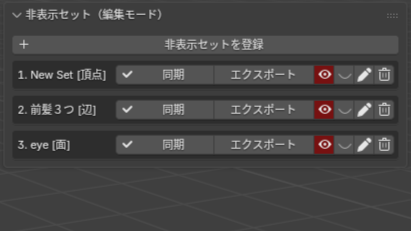

# Hide Set Manager（Blender Add-on）
Blender の頂点 / 辺 / 面 / オブジェクトの「非表示状態」をセットとして登録・管理し、  
表示・非表示の切り替えや復元を再現性高く行うためのアドオンです。

---

## スクリーンショット（Screenshots）

### 1. メイン UI

---

### 2. 非表示セットの登録（＋）

---

### 3. 表示 / 非表示 / トグルの実例
**Before（非表示）**

**After（表示 / トグル適用）**

---

### 4. 差分同期（Sync）
**差分が発生する例**

**⚠ 差分あり（未同期）**

**✓ 同期後（解決）**

---

### 5. JSON Export

---

## 概要（Overview）
Blender では編集モードで一時的に隠した要素を保持することが難しく、  
複雑な作業では再現性や管理性に課題があります。

**Hide Set Manager** は、永続 ID（Persistent ID）を用いて要素の非表示状態を記録し、  
次のような操作を素早く・安全に行えるようにします：

- 非表示セットの登録  
- 一括表示 / 非表示  
- トグル切り替え  
- 差分同期（現在の状態とセット内容を比較して更新）  
- JSON エクスポート

---

## 特徴（Features）
- **永続IDによる要素追跡**  
  メッシュ要素に一意の ID を振り、形状編集後も同じ要素を参照できます。

- **編集モード / オブジェクトモード両対応**  
  頂点・辺・面・オブジェクトを個別に管理できます。

- **差分同期（Sync）機能**  
  現在の状態との差分を検出し、保存内容を更新します。  
  UI では変更の有無をアイコンで可視化。

- **JSON エクスポート**  
  他プロジェクトとの共有やバージョン管理が可能。

- **安全な BMesh 操作ラッパ**  
  編集モードと非編集モードで処理を統一し、例外ログも記録。

---

## インストール方法（Installation）

1. このリポジトリを ZIP でダウンロード  
2. Blender → プリファレンス → アドオン  
3. 「インストール」から ZIP を選択  
4. サイドバー（Nキー）に「非表示管理」タブが追加されます

---

## 使い方（Usage）

### 1. 非表示セットを登録
1. 編集モードで要素を選択  
2. 「非表示管理」タブ → **＋（追加）** をクリック  
3. セット名・モード（頂点 / 辺 / 面）を指定

### 2. 表示 / 非表示の切り替え
- 👁（表示）
- 🚫（非表示）
- ↔（トグル）

### 3. 差分同期（Sync）
- 現在のシーン状態と比較  
- 変化があれば更新  
- 不一致は UI 上に「エラー（⚠）」アイコンで通知

### 4. JSON エクスポート
- 任意の HideSet を外部 JSON として保存  
- アセット管理やプロジェクト共有に利用可能

---

## オプション・設定（Options）

| 項目                        | 説明 |
|-----------------------------|------|
| セット名                   | HideSet の表示名 |
| モード（VERT / EDGE / FACE / OBJECT） | 登録対象の種類 |
| SHOW / HIDE / Toggle        | 表示切替の操作 |
| Sync                        | 差分比較と更新 |
| Export                      | JSON 書き出し |

---

## アーキテクチャ（Architecture）

ディレクトリ構成：

HideSetManager/
├─ __init__.py # Blenderにアドオンの入口
├─ core/
│ ├─ registry.py # HideSet・ElementRefのデータモデル（PropertyGroup）
│ ├─ pid.py # 永続IDレイヤー / PID マップ
│ ├─ diff.py # 差分同期（Sync / Preview）
│ ├─ bmesh_ops.py # BMesh操作の共通ラッパ
├─ ui/
│ ├─ operators.py # 登録 / 適用 / トグル / 同期 / Export などのオペレーター群
│ ├─ panels.py # UI パネル（編集/オブジェクトモード）
├─ utils/
│ ├─ logging.py # 統一例外ログ（log_exc）
│ ├─ safe_hidden.py # hide_set / hide_viewport / hide の安全統一処理
│ ├─ mesh.py # PID操作 / BMeshラッパ / 非表示処理（アドオンの重要コア）
├─ data/
│ └─ serializer.py # JSONエクスポート

---

## 主な技術要素（Technical Highlights）

- Persistent ID（hm_vid / hm_eid / hm_fid）  
- BMesh API を用いた高速処理  
- Python PropertyGroup によるデータ永続化  
- Operator / Panel の明確な責務分離  
- 例外ログの統一（log_exc）

---

## 開発状況（Development Status）
- 現在：v3.3.0  
- 主要機能は安定しています  
- UI の改善と差分機能の拡張を予定  

---

## 既知の問題（Known Issues）
- 大規模メッシュで同期処理が重くなる場合があります  
- EEVEE / Workbench 表示設定により「隠れ方」が異なるケースがあります  

---

## 対応バージョン（Compatibility）
- Blender **5.0** 以降推奨  
- Windows / macOS / Linux で動作確認済み  

---

## ライセンス（License）
MIT License

---

## 作者（Author）
kawamura（Hide Set Manager 開発者）

